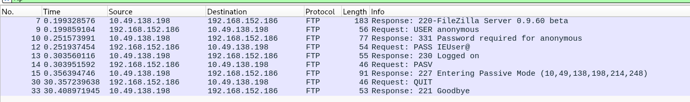

# Network Port Scanning & Traffic Analysis Lab

## Overview
Performed real-world Nmap scanning and live packet analysis using Wireshark 
on a TryHackMe lab target. Practiced different scan types, firewall evasion 
techniques, and NSE script usage.

## Tools Used
- Nmap
- Wireshark
- Debian Linux

## Target
TryHackMe lab machine (10.49.138.198) — Windows host
---

## 1. Basic Port Scan
```
# Nmap 7.95 scan initiated Mon May  4 20:08:24 2026 as: nmap -sn -oN ping_result.txt 10.49.138.198
Nmap scan report for 10.49.138.198
Host is up (0.051s latency).
# Nmap done at Mon May  4 20:08:24 2026 -- 1 IP address (1 host up) scanned in 0.09 seconds
```

---

## 2. Full SYN Scan (First 5000 ports)
```
# Nmap 7.95 scan initiated Mon May  4 20:25:19 2026 as: nmap -sS -p 1-5000 -Pn -oN syn_result.txt 10.49.138.198
Nmap scan report for 10.49.138.198
Host is up (0.052s latency).
Not shown: 4995 filtered tcp ports (no-response)
PORT     STATE SERVICE
21/tcp   open  ftp
53/tcp   open  domain
80/tcp   open  http
135/tcp  open  msrpc
3389/tcp open  ms-wbt-server

# Nmap done at Mon May  4 20:25:37 2026 -- 1 IP address (1 host up) scanned in 18.61 seconds
```
Found 5 open ports: 21 (FTP), 53 (DNS), 80 (HTTP), 135 (MSRPC), 3389 (RDP)

---

## 3. Xmas Scan (First 999 ports)
```
# Nmap 7.95 scan initiated Mon May  4 20:13:06 2026 as: nmap -sX -Pn -oN xmas_result.txt -p 1-999 10.49.138.198
Nmap scan report for 10.49.138.198
Host is up.
All 999 scanned ports on 10.49.138.198 are in ignored states.
Not shown: 999 open|filtered tcp ports (no-response)

# Nmap done at Mon May  4 20:16:27 2026 -- 1 IP address (1 host up) scanned in 201.33 seconds
```
All ports returned open|filtered — expected behavior against Windows targets 
because Windows does not send RST packets in response to malformed flag combinations,
making firewall evasion scans unreliable against Windows.

---

## 4. TCP Connect Scan + Wireshark Analysis
Ran a TCP Connect scan against port 80 while capturing traffic in Wireshark.


Observed full 3-way handshake:
- SYN → target
- SYN/ACK ← target  
- ACK → target
- RST/ACK → target (Nmap closes connection after confirming port is open)

---

## 5. FTP Anonymous Login — ftp-anon NSE Script
Deployed the ftp-anon script against port 21 while capturing in Wireshark.



Wireshark captured the full FTP conversation:
- Nmap attempted anonymous login (USER anonymous / PASS IEUser@)
- Server responded with 230 Logged on — anonymous login successful
- Confirms FTP server allows unauthenticated access (security risk)

---

## What I Learned
- Different Nmap scan types and when to use each
- Why -Pn is needed for Windows targets that block ICMP
- How FIN/NULL/Xmas scans attempt firewall evasion and why they 
  fail against Windows
- How to read live packet captures in Wireshark
- How NSE scripts automate service interaction (ftp-anon)
- How to save scan results with -oN for documentation

## References
- TryHackMe Nmap Room: https://tryhackme.com/room/furthernmap
- My TryHackMe Profile: https://tryhackme.com/p/redowanislammomin
